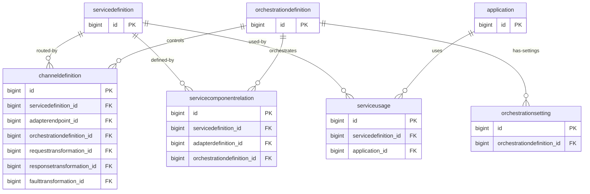
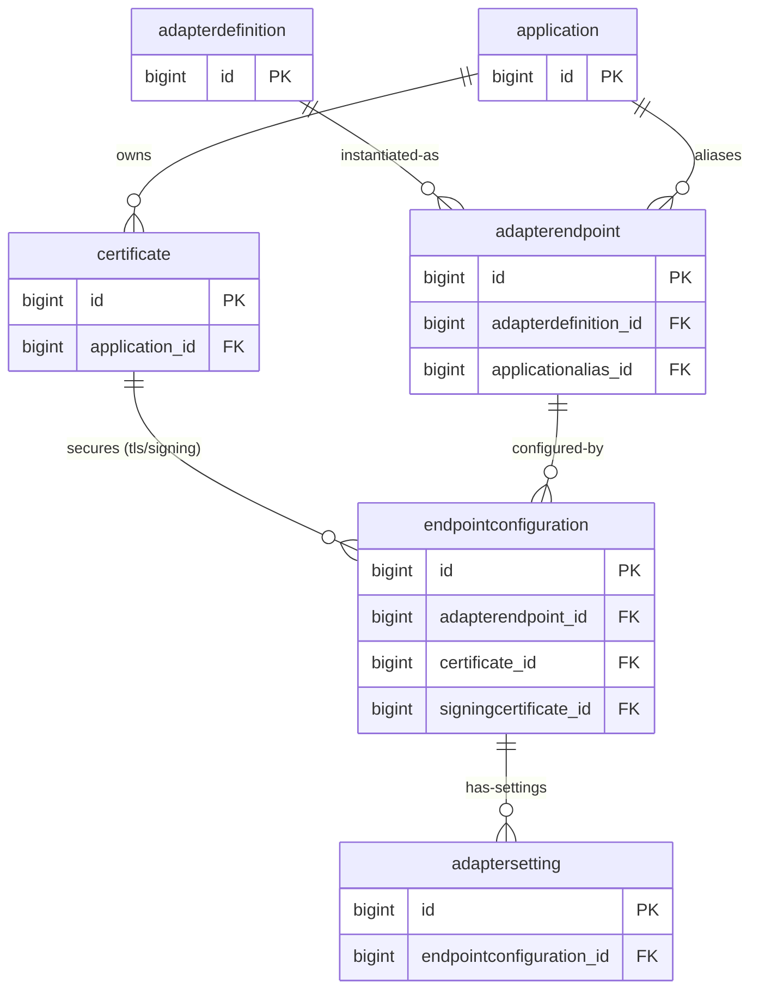
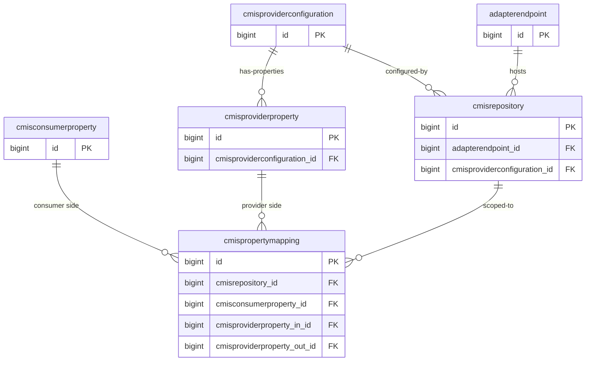
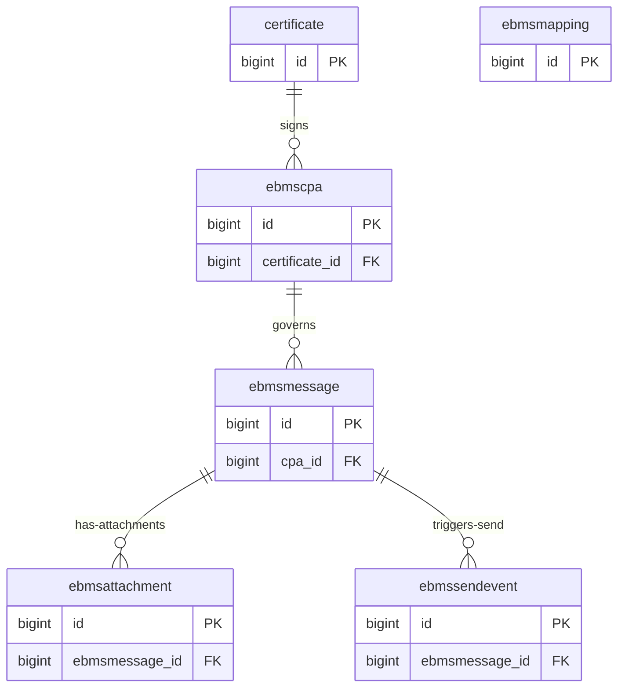
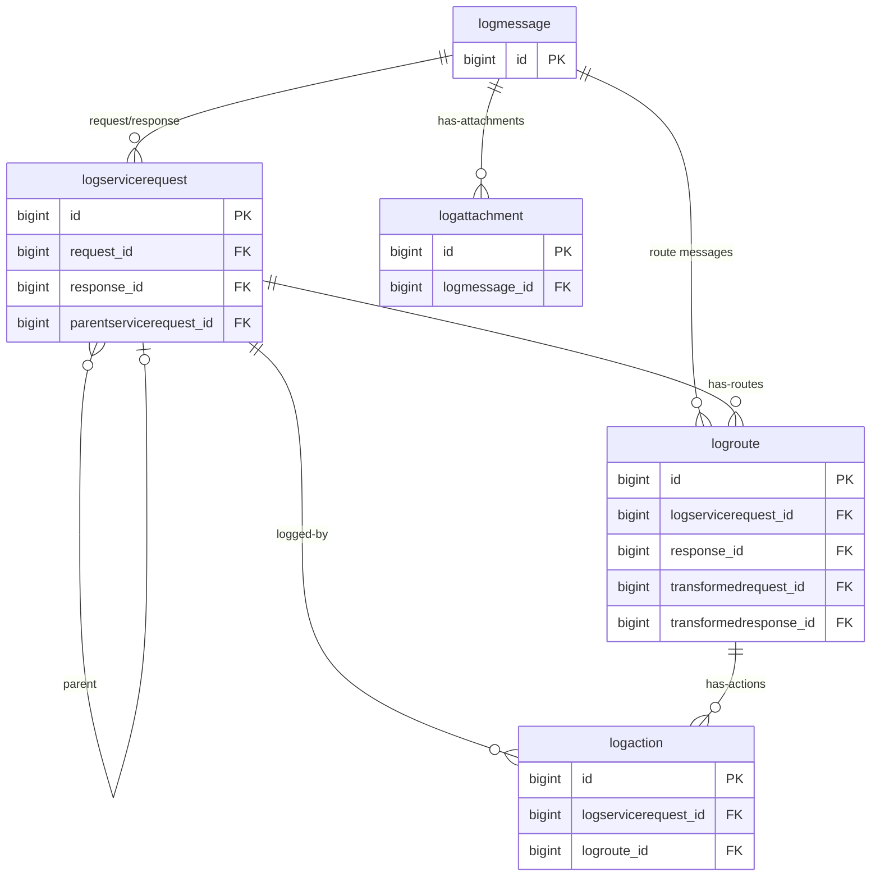
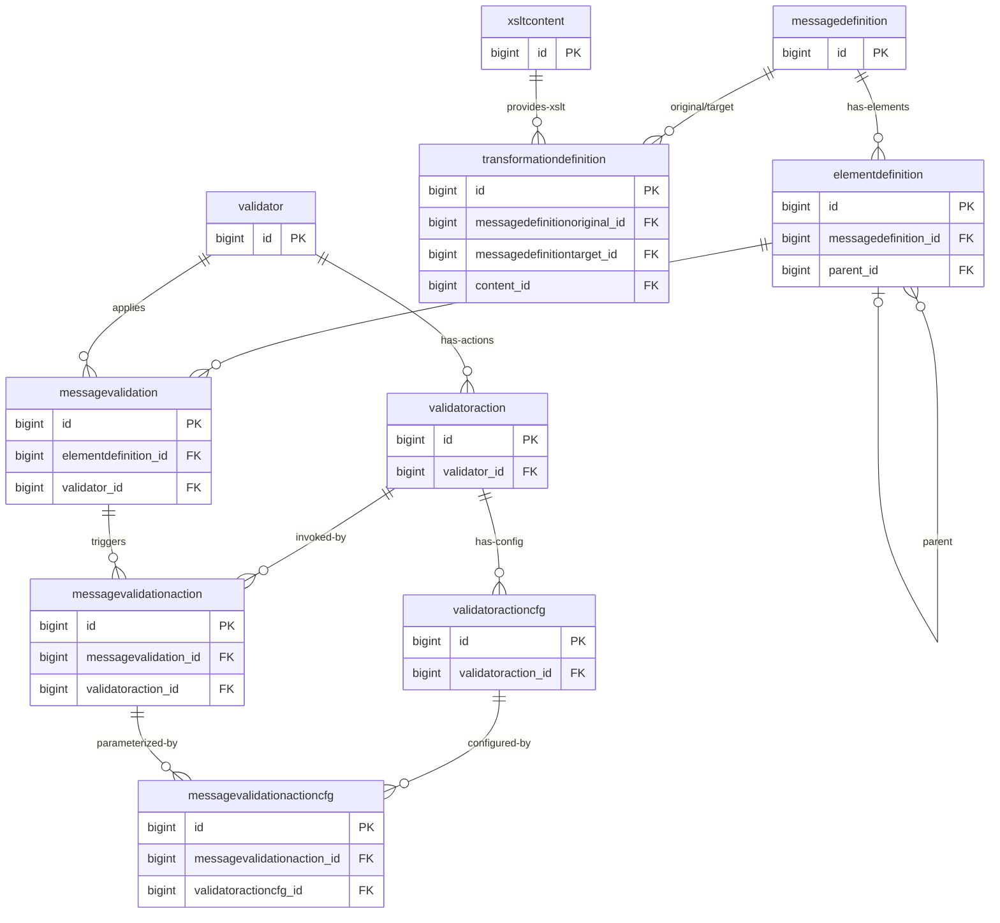

# CGS Schema — ER Diagrams

> Schema: `igp_ontwikkel_cgs_owner` | Generated: 2026-05-08 (live inspection)
> Tables: 46 | FK constraints: 66 | Audit tables excluded from diagrams

---

## FK Dependency Graph

Root/reference tables (no outgoing FKs — only referenced by others):

```
Root tables (referenced, never reference others):
  servicedefinition ◀── servicecomponentrelation, serviceusage, channeldefinition
  messagedefinition ◀── servicecomponentrelation, channeldefinition, transformationdefinition, elementdefinition
  orchestrationdefinition ◀── servicecomponentrelation, channeldefinition, orchestrationsetting
  validator ◀── messagevalidation, validatoraction
  logmessage ◀── logservicerequest (x2), logroute (x3), logattachment
  xsltcontent ◀── transformationdefinition
  adapterdefinition ◀── adapterendpoint, servicecomponentrelation
  cmisproviderconfiguration ◀── cmisproviderproperty, cmisrepository
  cmisconsumerproperty ◀── cmispropertymapping
  revinfo ◀── all _aud tables (system)
  cgssetting  (isolated, no FKs)
  ebmsmapping (isolated, no FKs)
```

Junction/bridge tables (surrogate PK + UNIQUE on FK pair):

| Table | Bridges | UNIQUE constraint |
|---|---|---|
| `serviceusage` | `application` ↔ `servicedefinition` | (servicedefinition_id, application_id) |
| `messagevalidationaction` | `messagevalidation` ↔ `validatoraction` | (messagevalidation_id, validatoraction_id) |
| `messagevalidationactioncfg` | `messagevalidationaction` ↔ `validatoractioncfg` | (messagevalidationaction_id, validatoractioncfg_id) |
| `cmispropertymapping` | `cmisconsumerproperty` ↔ `cmisproviderproperty` | multiple UNIQUE constraints per direction |

---

## Full ER Diagram (Core Tables — Audit Tables Excluded)

```mermaid
erDiagram
    application {
        bigint id PK
        bigint application_id FK
    }
    applicationopeningperiod {
        bigint id PK
        bigint application_id FK
    }
    certificate {
        bigint id PK
        bigint application_id FK
    }
    adapterdefinition {
        bigint id PK
    }
    adapterendpoint {
        bigint id PK
        bigint adapterdefinition_id FK
        bigint applicationalias_id FK
    }
    endpointconfiguration {
        bigint id PK
        bigint adapterendpoint_id FK
        bigint certificate_id FK
        bigint signingcertificate_id FK
    }
    adaptersetting {
        bigint id PK
        bigint endpointconfiguration_id FK
    }
    servicedefinition {
        bigint id PK
    }
    serviceusage {
        bigint id PK
        bigint servicedefinition_id FK
        bigint application_id FK
    }
    messagedefinition {
        bigint id PK
    }
    xsltcontent {
        bigint id PK
    }
    transformationdefinition {
        bigint id PK
        bigint messagedefinitionoriginal_id FK
        bigint messagedefinitiontarget_id FK
        bigint content_id FK
    }
    orchestrationdefinition {
        bigint id PK
    }
    orchestrationsetting {
        bigint id PK
        bigint orchestrationdefinition_id FK
    }
    channeldefinition {
        bigint id PK
        bigint servicedefinition_id FK
        bigint adapterendpoint_id FK
        bigint orchestrationdefinition_id FK
        bigint filterprovidingapplication_id FK
        bigint filtermessagedefinition_id FK
        bigint requesttransformation_id FK
        bigint responsetransformation_id FK
        bigint faulttransformation_id FK
    }
    servicecomponentrelation {
        bigint id PK
        bigint servicedefinition_id FK
        bigint adapterdefinition_id FK
        bigint orchestrationdefinition_id FK
        bigint messagedefinitionrequest_id FK
        bigint messagedefinitionresponse_id FK
        bigint messagedefinitionfault_id FK
    }
    elementdefinition {
        bigint id PK
        bigint messagedefinition_id FK
        bigint parent_id FK
    }
    validator {
        bigint id PK
    }
    validatoraction {
        bigint id PK
        bigint validator_id FK
    }
    validatoractioncfg {
        bigint id PK
        bigint validatoraction_id FK
    }
    messagevalidation {
        bigint id PK
        bigint elementdefinition_id FK
        bigint validator_id FK
    }
    messagevalidationaction {
        bigint id PK
        bigint messagevalidation_id FK
        bigint validatoraction_id FK
    }
    messagevalidationactioncfg {
        bigint id PK
        bigint messagevalidationaction_id FK
        bigint validatoractioncfg_id FK
    }
    logmessage {
        bigint id PK
    }
    logservicerequest {
        bigint id PK
        bigint request_id FK
        bigint response_id FK
        bigint parentservicerequest_id FK
    }
    logroute {
        bigint id PK
        bigint logservicerequest_id FK
        bigint response_id FK
        bigint transformedrequest_id FK
        bigint transformedresponse_id FK
    }
    logaction {
        bigint id PK
        bigint logservicerequest_id FK
        bigint logroute_id FK
    }
    logattachment {
        bigint id PK
        bigint logmessage_id FK
    }
    cmisproviderconfiguration {
        bigint id PK
    }
    cmisproviderproperty {
        bigint id PK
        bigint cmisproviderconfiguration_id FK
    }
    cmisconsumerproperty {
        bigint id PK
    }
    cmisrepository {
        bigint id PK
        bigint adapterendpoint_id FK
        bigint cmisproviderconfiguration_id FK
    }
    cmispropertymapping {
        bigint id PK
        bigint cmisrepository_id FK
        bigint cmisconsumerproperty_id FK
        bigint cmisproviderproperty_in_id FK
        bigint cmisproviderproperty_out_id FK
    }
    ebmscpa {
        bigint id PK
        bigint certificate_id FK
    }
    ebmsmessage {
        bigint id PK
        bigint cpa_id FK
    }
    ebmsattachment {
        bigint id PK
        bigint ebmsmessage_id FK
    }
    ebmssendevent {
        bigint id PK
        bigint ebmsmessage_id FK
    }
    ebmsmapping {
        bigint id PK
    }

    application ||--o{ applicationopeningperiod : "has opening periods"
    application ||--o{ certificate : "owns"
    application ||--o{ adapterendpoint : "aliases"
    application ||--o{ serviceusage : "uses service"
    application ||--o{ channeldefinition : "filter provider"
    application }o--o| application : "parent app"

    adapterdefinition ||--o{ adapterendpoint : "instantiated-as"
    adapterdefinition ||--o{ servicecomponentrelation : "component"

    adapterendpoint ||--o{ endpointconfiguration : "configured-by"
    adapterendpoint ||--o{ channeldefinition : "routes-via"
    adapterendpoint ||--o{ cmisrepository : "hosts"

    certificate ||--o{ endpointconfiguration : "secures"
    certificate ||--o{ ebmscpa : "signs-cpa"

    endpointconfiguration ||--o{ adaptersetting : "has-settings"

    servicedefinition ||--o{ serviceusage : "used-by app"
    servicedefinition ||--o{ servicecomponentrelation : "defined-by"
    servicedefinition ||--o{ channeldefinition : "routed-by"

    messagedefinition ||--o{ servicecomponentrelation : "req/resp/fault"
    messagedefinition ||--o{ channeldefinition : "filter"
    messagedefinition ||--o{ transformationdefinition : "transforms"
    messagedefinition ||--o{ elementdefinition : "has-elements"

    xsltcontent ||--o{ transformationdefinition : "provides-xslt"

    orchestrationdefinition ||--o{ orchestrationsetting : "has-settings"
    orchestrationdefinition ||--o{ servicecomponentrelation : "orchestrates"
    orchestrationdefinition ||--o{ channeldefinition : "controls"

    transformationdefinition ||--o{ channeldefinition : "req/resp/fault transform"

    elementdefinition }o--o| elementdefinition : "parent element"
    elementdefinition ||--o{ messagevalidation : "validated-by"

    validator ||--o{ validatoraction : "has-actions"
    validator ||--o{ messagevalidation : "applies"

    validatoraction ||--o{ validatoractioncfg : "has-config"
    validatoraction ||--o{ messagevalidationaction : "invoked-by"

    validatoractioncfg ||--o{ messagevalidationactioncfg : "configured-by"

    messagevalidation ||--o{ messagevalidationaction : "triggers"

    messagevalidationaction ||--o{ messagevalidationactioncfg : "parameterized-by"

    logmessage ||--o{ logservicerequest : "request/response msg"
    logmessage ||--o{ logroute : "routed messages"
    logmessage ||--o{ logattachment : "has-attachments"

    logservicerequest }o--o| logservicerequest : "parent request"
    logservicerequest ||--o{ logroute : "has-routes"
    logservicerequest ||--o{ logaction : "logged-by"

    logroute ||--o{ logaction : "has-actions"

    cmisproviderconfiguration ||--o{ cmisproviderproperty : "has-properties"
    cmisproviderconfiguration ||--o{ cmisrepository : "configured-by"

    cmisconsumerproperty ||--o{ cmispropertymapping : "mapped-from"
    cmisproviderproperty ||--o{ cmispropertymapping : "mapped-to (in)"
    cmisproviderproperty ||--o{ cmispropertymapping : "mapped-to (out)"
    cmisrepository ||--o{ cmispropertymapping : "scoped-to"

    ebmscpa ||--o{ ebmsmessage : "governs"
    ebmsmessage ||--o{ ebmsattachment : "has-attachments"
    ebmsmessage ||--o{ ebmssendevent : "triggers-send"
```



---

## Domain ER Diagrams

### Domain 1 — Service Bus Core (Service / Channel / Component)



### Domain 2 — Adapter / Endpoint



### Domain 3 — CMIS



### Domain 4 — ebMS Messaging



### Domain 5 — Logging



### Domain 6 — Message / Transformation / Validation



---

## Domain-Grouped Table Summary

> Inspection date: 2026-05-08 | Source: live `igp_ontwikkel` database

| Domain | Tables (non-audit) | Rows | Notes |
|---|---|---|---|
| **Service Bus Core** | servicedefinition, channeldefinition, servicecomponentrelation, serviceusage, orchestrationdefinition, orchestrationsetting | 220+14+41+657+0+0 = **932** | Central routing logic |
| **Application** | application, applicationopeningperiod, certificate | 7+0+0 = **7** | Registered applications |
| **Adapter / Endpoint** | adapterdefinition, adapterendpoint, endpointconfiguration, adaptersetting | 7+14+491+0 = **512** | Adapter infrastructure |
| **Message / Transformation** | messagedefinition, elementdefinition, transformationdefinition, xsltcontent | 32+0+5+1 = **38** | Message schemas & XSLTs |
| **Validation** | validator, validatoraction, validatoractioncfg, messagevalidation, messagevalidationaction, messagevalidationactioncfg | 0+0+0+0+0+0 = **0** | Unused in current env |
| **CMIS** | cmisrepository, cmisproviderconfiguration, cmisproviderproperty, cmisconsumerproperty, cmispropertymapping | 2+2+28+23+14 = **69** | CMIS integration |
| **ebMS Messaging** | ebmscpa, ebmsmessage, ebmsattachment, ebmssendevent, ebmsmapping | 0+0+0+0+0 = **0** | Unused in current env |
| **Logging** | logmessage, logservicerequest, logroute, logaction, logattachment | 66+22+22+148+0 = **258** | Runtime audit trail |
| **System** | cgssetting, revinfo | 0+106 = **106** | Platform metadata |
| **Audit (_aud)** | adapterendpoint_aud, adaptersetting_aud, application_aud, channeldefinition_aud, endpointconfiguration_aud, orchestrationsetting_aud | 14+3+7+25+57+0 = **106** | JPA Envers audit history |
